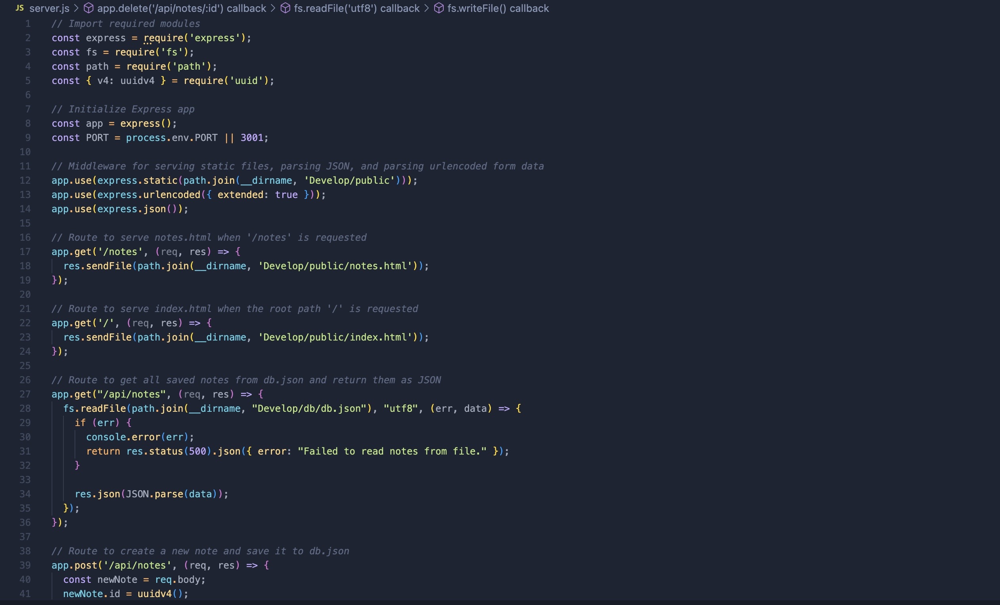

# Take Notes!

# Description

This application was fun to build. I started with a starter code, and built the server.js file. It uses Express.js to GET POPST and DELETE information and is stored to the server as JSON. It allows you to take notes, save the notes, and access them by simply clicking on the saved note in tbe left side of the page. To add a new note, simply press the plus button. To save a note, when you start typing, a save icon will appear in the top right next to the plus button.

# Link to live website

# Table of Contents
* [Installation](#installation)
* [Usage](#usage)
* [Credits](#credits)

# Installation

To install this project, clone the repository from GitHub and open it in your own IDE. Run npm i express and npm i uuid to install the dependencies.

# Usage

In your IDE, open the command line and type in npm start or node server.js. This will start the server, and direct you to http://localhost:3001. To deploy a live website, follow the Heroku documentation to deploy.

Screenshots of the code

Screenshot of the deployed website

# Credits

This application was built from scratch by Kyle Parks